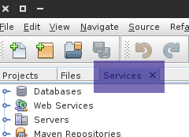
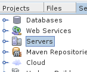
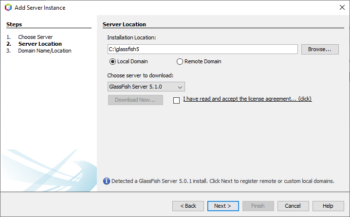

Java EE 8 Web

* Table of Contents
{:toc}


## Get started

You will need the following materials to study and deploy the project.

1. Netbeans IDE 12.0 - to edit the code.
2. Java JDK 8 u241
3. Glassfish Server 5.0.1
4. MySQL 5.7
5. Git and a Github Account

*It’s very important to use the versions stated above, since otherwise the system may not work.*

Installation procedures are described below. It was tested on a Windows 10 x64 machine, but it should also work on Linux or Mac aswell, given the proper installation steps.


---

### Java

- Download and install the [**JDK 1.8.0 u241**](https://www.oracle.com/java/technologies/javase/javase8u211-later-archive-downloads.htm)

---

### Glassfish Server 5.0.1 

- Download [**Glassfish Server 5.0.1 - Full Platform**](https://javaee.github.io/glassfish/download)
- Extract somewhere you’ll remember

---

### MySQL Server 5.7

- Download the [**MySQL Server Installer**](https://dev.mysql.com/downloads/windows/installer/8.0.html)
- Make sure you download the Web Installer so you can select different server versions
- During Installation, select:
  - MySQL Server 5.7
  - MySQL Connector/J 5.1.23
  - (OPTIONAL) MySQL Workbench - but it’s useful to manage the database, especially if you are not used to the CMD interface

#### Setup the database

We need to setup MySQL server and the project's database.
- Set the Server “default-time-zone” property to “+00:00” (otherwise the Java connector may not work properly)
- Create the user and the project's database. To do so you can either use the terminal or MySQL Workbench. Run the following SQL script:

```
create user aes@localhost identified by "aes1235";
```

```
create database aes;
```

```
grant all privileges on aes.* to aes@localhost;
```

---

### Git and Github

- To download and work with the project we recommend *Git*. With *Git* you will be able to fork the project and distribute the code easily. 
- You can download and install it [**here**](https://git-scm.com/downloads)


#### For the git newbies
1. Create an account [here](https://www.github.com/join).
2. On the terminal (or Git Bash), type the following commands with your own information.

```
git config --global user.name "John Doe"
```

```
git config --global user.email johndoe@example.com
```

---

### NetBeans IDE

- Download and install [**Netbeans 12LTS**](https://netbeans.apache.org/download/index.html)
- Make sure to use the JDK you downloaded earlier during the installation
- (for Windows) Make sure to always run Netbeans as Administrator

---

## Donwload the project

To download, just open the terminal (or git Bash) in any folder you want and type:

```
git clone https://github.com/crepeia/aes.git
```

Done. Now the project folder is located in the folder you opened the terminal in.

---

## Setup the project with Netbeans
Now we need to configure the IDE. So run Netbeans as administrator and follow the steps below.

### Setup Glassfish


#### Step 1
Left-click on services tab.



#### Step 2
Right-click on server



#### Step 3
Select “Add Server” and add a new Glassfish server.
Make sure to select the folder you extracted it to during setup:



### Setup the database
#### Step 1
Still on “Services” tab, expand “Databases”

#### Step 2
Expand "Drivers" and setup the MySQL (Connector/J driver)


#### Step 3
Click on "Add" and find the MySQL Connector/J 5.1.23 you installed with MySQL


#### Step 4
Click on “Find” button and select the “com.mysql.jdbc.Driver”


#### Step 5
Create a new connection with this driver:
- Use the user and password created earlier during the database setup
- Use the following JDBC URL:

```
jdbc:mysql://localhost:3306/aes?zeroDateTimeBehavior=convertToNull
```


---


## Run

If you have completed the steps above, go to Files -> open project and browse to the folder where you downloaded the project. Now execute de project using the *Run* command.

---

## Translation

The translation files are located in "Source Packages" folder, inside the controller "wati-utility". They all have names starting with messages_xx_properties.

---


## Graphics

### Images and Vectors
The images are in Web Pages -> resources -> default -> images. If you like to change and adapt them, use the vector file 'img-vector.svg' located in /flowchart and request folder. We recommend the open-source software [Inkscape](http://www.inkscape.org/en/) to work with vector graphics.

### Video
You can download the editable intro video [here](http://www.blendswap.com/blends/view/71482). To create the intro video, we used Blender, an all-around open-source 3d editor. You can download it [here](http://www.blender.org/). Be advised: blender is tricky and has a steep learning curve, feel free to reach us.

### Stylesheet
The CSS code is located in Web Pages -> resources -> default -> css.
---

## Seeking help?

Reach us at henriquepgomide@gmail.com
